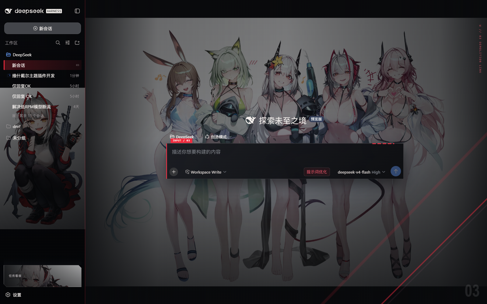
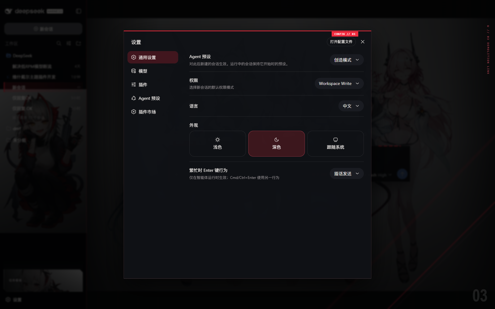

# Wishadel Demolition Terminal

面向 DeepSeek Harness Web GUI 的维什戴尔主题插件。

视觉方向不是传统游戏金属框，而是明日方舟式信息终端与维什戴尔爆破涂写：黑灰信息层、细线框、编号、警示切角、红色状态轨、网点和不对称构图。

## 预览

### 对话界面



左侧导航、会话背景、用户消息、工具调用行、状态遥测和切角输入器都由主题统一处理。

### 设置界面



主题的配置入口位于 DSH 设置页的插件区域。不同 DSH 版本可能显示为“插件配置”或“可配置”。

## 功能

除维什戴尔主题外，本插件提供四组功能，全部收敛在「设置 > 插件 > 插件配置」中开关与调参（保存即生效，持久化于宿主）：

- **任务看板**：侧栏底部「任务看板」进入。任务按 待规划 / 待办 / 进行中 / 已完成 / 已失败 五列组织；点击「执行」由真实 DSH 智能体会话执行，完成/失败状态自动回写，可跳转执行会话复盘；支持 cron 定时执行（如 `0 23 * * *` 每天 23:00、`0 9 * * 1` 每周一 09:00），到点自动开工。
- **Git 图谱**：输入框上方分支选择器，切换分支、查看工作区状态；提交历史以分支泳道图可视化，点击提交查看详情与变更文件。
- **右侧工作台**：会话打开后，头部「面板」按钮展开/收起。内含「文件」（懒加载文件树 + 多标签预览：markdown、代码、CSV、PDF、图片、文本，支持源码/预览切换、编辑与保存）、「Git」（真实变更、stage / unstage / discard、差异与提交）、「浏览器」（HTTP/HTTPS 地址栏、历史导航、外部打开、默认 opaque-origin sandbox）、「终端」（会话隔离 shell、增量输出 cursor、输入/停止/清空）与「活动」（运行中会话、子代理投影、任务跳转）。面板宽度、折叠、当前 Tab、浏览器地址和底部辅助区域按会话/工作区持久化，支持键盘 Tab 导航与底部终端/活动面板。
- **设置中心**：主题选择（皮肤注册表 `window.__dshSkins`，便于后续接入更多主题）、终端装饰/角色图/会话背景、任务看板、Git 图谱、右侧面板的全部开关与参数。

宿主半边通过 `/wishadel/*` 同源接口与页面通信，任务、设置与面板状态持久化在 `$DSH_HOME/storages/wishadel/`。客户端通过 `ctx.wishadelWorkbench` 发布轻量扩展注册表，支持 `registerTab({ id, title, order, component })` 与 `registerFileViewer({ id, exts, priority, component })`；注册返回 disposer，兼容 HMR 生命周期。

## 覆盖范围

- Web GUI 全局背景与会话背景
- 宽侧栏、会话树、选中与运行状态
- 首页标题和输入器
- 对话头部、标签页、用户消息气泡
- 推理、上下文与工具调用行
- 问题卡、Todo、Cordis 审批面板
- 设置弹窗、菜单和浮层
- 响应式布局、减少动态效果
- 任务看板 / Git 图谱 / 右侧面板 / 设置中心的维什戴尔风格界面

所有素材都在预构建的 `lib/client.js` 中以内嵌 Data URI 分发，运行时不访问远程地址。

## 安装

推荐使用 DSH 官方插件管理命令，不需要手动 clone 仓库，也不需要运行项目脚本。

要求：已经可以运行 DSH，并且 Node.js 提供 Corepack。

```powershell
corepack enable
dsh plugin --profile web add git+https://github.com/cdxDNRF/wishadel-theme.git
```

安装完成后：

1. 重启 `dsh web`。
2. 刷新 `http://127.0.0.1:3080`。
3. 打开 `设置 → 插件 → 插件配置`。

如果你的环境找不到 `pnpm`，先运行 `corepack enable`；DSH 的 profile 插件命令会负责安装依赖、写入 Web profile，并把主题 bundle 加入组合配置。

> Git 安装说明：pnpm ≥10 默认拒绝运行 git 依赖的构建脚本，第一次 `add` 可能失败并提示授权——按提示把 pnpm 打印的包键加入该 profile 的 `pnpm-workspace.yaml` 的 `allowBuilds` 后重试即可。本包通过 `prepare` 脚本（`node scripts/build.mjs`，纯 Node 无第三方依赖）在安装时重建 `lib/`；仓库也同时提交了预构建产物，两种路径都能安装。

## 更新

使用同一个 DSH 官方命令重新解析远端包：

```powershell
dsh plugin --profile web add git+https://github.com/cdxDNRF/wishadel-theme.git
```

然后重启 `dsh web` 并刷新页面。若需要固定到某个 Git 提交，可使用 Git URL 片段或本地路径作为 package source。

## 配置

打开 `设置 → 插件 → 插件配置`，展开「维什戴尔终端」卡片即可开关全部功能与主题选项，保存后即时生效并持久化到宿主（`$DSH_HOME/storages/wishadel/settings.json`）。配置卡片自带重试按钮，若提示宿主服务未就绪，重启一次 `dsh web` 即可。

修改后立即生效。DeepSeek Harness `0.1.0-rc.6` 的 Web 配置 API 只向内置插件开放 settings namespace，因此本插件通过自己的 `/wishadel` 同源接口实现宿主持久化（不使用浏览器 localStorage）。

## 卸载

使用 DSH 官方插件管理命令移除主题：

```powershell
dsh plugin --profile web remove @cdxdnrf/dsh-client-ui-skin-wishadel
```

卸载后重启 `dsh web` 并刷新页面。该命令会移除主题 package dependency 以及 `dsh.profile.bundles` 中对应的 bundle，不修改其他插件。

仓库中的 `scripts/install.ps1` 和 `scripts/uninstall.ps1` 只是 PowerShell 包装器，适合无法直接调用完整命令的 Windows 环境；正常安装优先使用上面的 DSH 官方命令。

## 开发

源码与构建产物分离：

```text
assets/                  背景素材
src/client/*.js          客户端半边（主题核心、皮肤注册表、设置卡、任务看板、Git 图谱、右侧面板）
src/host/*.js            宿主半边（设置/任务/文件/Git 服务与 /wishadel 路由）
src/theme.css            主题样式
src/client.css           功能界面样式
scripts/build.mjs        无第三方依赖构建脚本（按序拼接为 lib/client.js 与 lib/index.js）
scripts/smoke-host.mjs   宿主半边冒烟测试（mock ctx 驱动全部路由）
scripts/smoke-client.mjs 客户端加载冒烟测试（mock window/React 执行 apply）
scripts/e2e-live.mjs     实机端到端验收（宿主上线后；含真实智能体任务执行，--cron 附加定时验证）
scripts/e2e-race.mjs     删除竞态回归（运行中任务不可删除、结算不击穿进程）
scripts/inspect-session.mjs  解压任务会话日志取证
lib/                     构建产物（客户端 bundle + 宿主 ESM）
docs/screenshots/        README 预览图
```

修改源码或素材后：

```powershell
node .\scripts\build.mjs            # 重建 lib/
node .\scripts\smoke-host.mjs       # 宿主冒烟（可选但推荐）
node .\scripts\smoke-client.mjs     # 客户端加载冒烟（可选但推荐）
node .\scripts\e2e-live.mjs --base http://127.0.0.1:3080   # 实机验收（宿主上线后）
```

生效方式：客户端 bundle 由 Web 服务器按请求实时读盘，重建后**浏览器硬刷新（Ctrl+F5）**即可；宿主半边在进程启动时装载，改动后需要**重启 `dsh web`**。以本地 link 方式安装（`package.json` 依赖为 `link:` 路径）时开发最顺手。

## 兼容性

当前针对 DeepSeek Harness `0.1.0-rc.6` Web GUI 验证。优先使用 `data-pane`、`data-phase`、`data-composer-*`、ARIA role/state 等稳定钩子，CSS Module 类名片段只作为兼容回退。

## 素材与许可

本项目是非商业性质的同人主题，与 Hypergryph/鹰角网络无隶属关系，也未获其背书。角色与《明日方舟》相关权利归各自权利人所有。详见 [NOTICE](NOTICE)。

项目代码和主题编排以 CC BY-NC-SA 4.0 发布。分发前请确保你有权重新分发替换后的背景素材。
